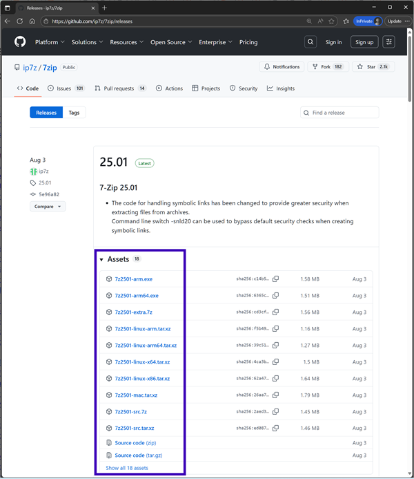
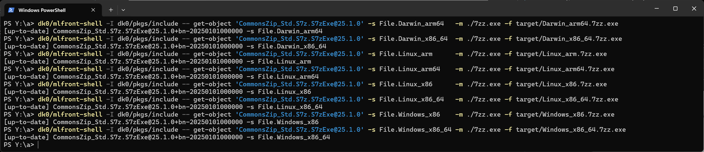
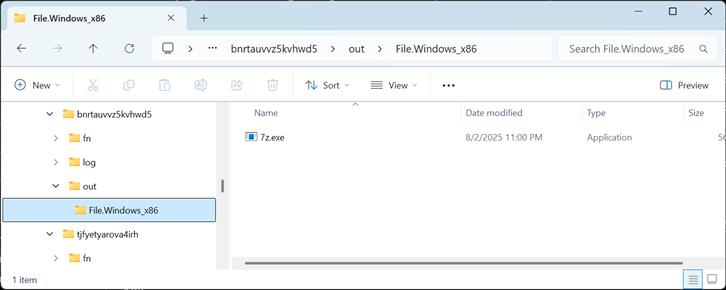
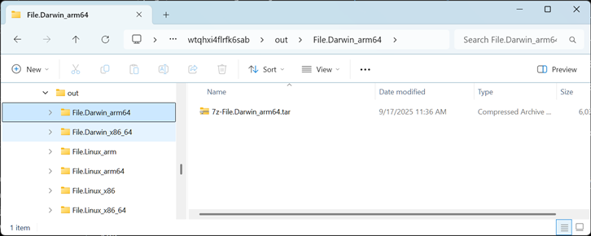

# dk - A terribly uninteresting build and scripting system

`dk` solves the problem of **README-itis**: you give your users a long README document, your users fail to setup your software, and you lose a user forever.

If you have a Linux application you could choose `nix` or Docker, but outside of that domain you have limited options. `dk` reliably builds software comparable to `nix` and Docker, but is designed for non-techie end-users (esp. Windows users) and has a few security controls and a spec for easy adoption into language build tools.

We'll use the software behind `dk` itself as an example of easy-to-fail, average-complexity software. `dk`'s scripting functionality requires a runtime environment and platform development kits are downloaded on-demand. We want our users (ex. you) to install and get started *quickly*. Users copy-and-paste the text blocks below on Windows. Go ahead and copy-and-paste yourself if you want to try the `dk` cross-compiling scripting environment, or skip past it to learn about the `dk` build tool:

<!-- Windows updates: dk Ml.Use -- .\maintenance\010-PROJECTROOT-README.sh -->

<!-- $MDX skip -->
```sh
# Install a standalone executable. And available for macOS and Linux.
$ winget install -e --id Diskuv.dk
```

<!-- $MDX skip -->
```sh
# THIS EXAMPLE: The `dk` software stack has scripting.
#      Here's a script to download and print a page to the screen.
# IN GENERAL: Your users copy-and-paste your first example ...
$ dk -S "
    module Uri = Tr1Uri_Std.Uri
  " -U "
    Tr1Stdlib_V414Io.StdIo.print_endline @@
    Lwt_main.run @@
    DkNet_Std.Http.fetch_url ~max_sz:4096 @@
    Uri.of_string {|https://jigsaw.w3.org/HTTP/h-content-md5.html|}
  " -O ReleaseSmall Exe

... THIS EXAMPLE: `dk` will install a scripting environment, download
... development kits on-demand for different platforms, and do a
... cross-compile. It *takes time* to download massive development kits.
... You (and your user) will do something else in another window, but as
... long as you don't have to type anything, you'll probably stick around!
... ⟳ ⟳ ⟳ software installed automatically ⟳ ⟳ ⟳
... ⟳ ⟳ ⟳         example executed         ⟳ ⟳ ⟳

# THIS EXAMPLE: `dk` scripting makes standalone executables.
# IN GENERAL: Your users get the results they want ...
$ file target/ZzZz_Zz.Adhoc-*
target/ZzZz_Zz.Adhoc-android_arm32v7a:   ELF 32-bit LSB pie executabl...
target/ZzZz_Zz.Adhoc-android_arm64v8a:   ELF 64-bit LSB pie executabl...
target/ZzZz_Zz.Adhoc-android_x86_64:     ELF 64-bit LSB pie executabl...
target/ZzZz_Zz.Adhoc-darwin_arm64:       Mach-O 64-bit executable arm...
target/ZzZz_Zz.Adhoc-darwin_x86_64:      Mach-O 64-bit executable x86...
target/ZzZz_Zz.Adhoc-linux_x86:          ELF 32-bit LSB pie executabl...
target/ZzZz_Zz.Adhoc-linux_x86_64:       ELF 64-bit LSB pie executabl...
target/ZzZz_Zz.Adhoc-windows_x86_64.exe: PE32+ executable (console) x...
target/ZzZz_Zz.Adhoc-windows_x86.exe:    PE32 executable (console) In...
```

You still need that long README for your complex software,
but **your software setup is boring and in your users' hands quickly**.

## Introduction

`dk` solves README-itis in two ways:

1. You model your actions (all that stuff you would put into a README) with scripts that `dk` will cross-compile for your users' platforms.
2. All required actions are executed as needed on your users' machines with dk's build tool.

Keep your setup boring: no interesting knobs, and no typing beyond the initial copy-and-paste.

Skip down to [Comparisons](#comparisons) for how `dk` fits with other tools.

The build tool is quite new and has not yet been integrated into the script runner. But it has a `dksrc/dk0` reference implementation which are documented in the next sections, and specifications are at [docs/SPECIFICATION.md](docs/SPECIFICATION.md).

Separately, a [Quick Start for Scripting](#quick-start---scripting) is further below, and the main documentation site for the script runner is <https://diskuv.com/dk/help/latest/>.

But we'll start with a walk-through of the **build tool** by unpackaging the popular zip compression software "7zip". (dk has no affliation with 7zip.)

---

- [dk - A terribly uninteresting build and scripting system](#dk---a-terribly-uninteresting-build-and-scripting-system)
  - [Introduction](#introduction)
  - [Concepts and Theory](#concepts-and-theory)
    - [Theory](#theory)
    - [Principles - Security](#principles---security)
  - [Using the Build Tool to create a multi-platform package](#using-the-build-tool-to-create-a-multi-platform-package)
    - [7zip assets](#7zip-assets)
    - [7zip extraction plan](#7zip-extraction-plan)
    - [7zip step 1 - download 7zr.exe](#7zip-step-1---download-7zrexe)
    - [7zip step 1b - hide 7zr.exe assets](#7zip-step-1b---hide-7zrexe-assets)
    - [7zip step 1c - add all assets](#7zip-step-1c---add-all-assets)
    - [7zip step 2 - extract 7z.exe from Windows installers](#7zip-step-2---extract-7zexe-from-windows-installers)
    - [7zip step 3 - uncompress Unix tar from Unix compressed archives](#7zip-step-3---uncompress-unix-tar-from-unix-compressed-archives)
    - [7zip step 4 - extract 7zz from Unix tar](#7zip-step-4---extract-7zz-from-unix-tar)
    - [7zip - package interface](#7zip---package-interface)
    - [7zip - building in GitHub Actions](#7zip---building-in-github-actions)
    - [7zip - summary](#7zip---summary)
  - [Using the Build Tool to debug a failed form](#using-the-build-tool-to-debug-a-failed-form)
  - [Quick Start - Scripting](#quick-start---scripting)
  - [Comparisons](#comparisons)
  - [Licenses](#licenses)
  - [Open-Source](#open-source)

## Concepts and Theory

In the `dk` build system, you submit *forms* that produce *objects* created from *assets*.

The **assets** are input materials. These are files and folders, and they can be local or remote: source code, data files, audio, image and video files.

A **form** is a document with fields and a submit button. At some point ... not now ... there will be a graphical user interface (GUI) for these forms. But the command line interface (CLI) fallback is available today and forever: you use the DOS or Unix terminal, and the document is a command line in your terminal.

An **object** is a folder that the form produces.

Again: You submit *forms* that produce *objects* created from *assets*.

Finally, we introduce our fourth (4th) word: **value**. A value is any bundle, form or object.

Let's relate these concepts to a build activity: our task is to unpack a 7zip executable (`7zz` on Unix or `7z.exe` on Windows) from official, platform-specific 7zip installers.

This is *not* a toy problem! We would need the 7zip executable if our second task were to unpack a `git` executable from a [Portable Git Installer](https://github.com/git-for-windows/git/releases).

For unpacking the 7zip executables, we'll submit a form several times (each time with different parameters):

```sh
$ git clone https://github.com/diskuv/dk.git dksrc
Cloning into 'dksrc'...
$ dksrc/dk0 get-object 'CommonsBase_Std.S7z@25.1.0' -s Release.Darwin_x86_64 -m ./7zz.exe -f target/Darwin_x86_64.7zz.exe
[up-to-date] CommonsBase_Std.S7z@25.1.0+bn-20250101000000 -s Release.Darwin_x86_64
```

which *builds* the desired files into our desired "target" directory:

```text
    Directory: Y:\a\target


Mode                 LastWriteTime         Length Name
----                 -------------         ------ ----
-a----         9/17/2025  11:36 AM        5885696 Darwin_arm64.7zz.exe
-a----         9/17/2025  11:36 AM        5885696 Darwin_x86_64.7zz.exe
-a----         9/17/2025  11:36 AM        1548480 Linux_arm.7zz.exe
-a----         9/17/2025  11:36 AM        2456896 Linux_arm64.7zz.exe
-a----         9/17/2025  11:36 AM        3192444 Linux_x86.7zz.exe
-a----         9/17/2025  11:36 AM        2878000 Linux_x86_64.7zz.exe
-a----         9/17/2025  11:36 AM         575488 Windows_x86.7zz.exe
-a----         9/17/2025  11:36 AM         575488 Windows_x86_64.7zz.exe
```

so you can see the concepts in action:

| Concept               | Examples                                                                                                             |
| --------------------- | -------------------------------------------------------------------------------------------------------------------- |
| **Assets**            |                                             |
| **Submitting Forms**  |                                                         |
| **Generated Objects** | `Y:\a\target\pid\500\bnrtauvvz5kvhwd5\out\Release.Windows_x86`:<br> |
|                       | `Y:\a\target\pid\500\wtqhxi4flrfk6sab\out\Release.Darwin_arm64`:<br>          |

The objects you see above are intermediate folders, so this might be the first and only time you see them. Normally you pull files out of objects into your own target directories, like was done when we submitted the form with `dksrc/dk0 ... -f target/Darwin_x86_64.7zz.exe`.

**Values** have unique identifiers. We used one when we submitted the form: `CommonsBase_Std.S7z@25.1.0`.

These identifiers contain versions like `25.1.0`. Making a change to a value means creating a new value with the same name but with an increased version. For example, if the text of your 2025-09-04 privacy policy is in the bundle `YourOrg_Std.StringsForWebSiteAndPrograms.PrivacyPolicy@1.0.20250904`, an end-of-year update to the privacy policy could be `YourOrg_Std.StringsForWebSiteAndPrograms.PrivacyPolicy@1.0.20251231`. These *semantic* versions offer a lot of flexibility and are industry-standard: [external link: semver 2.0](https://semver.org/). The important point is that **values do not change; versions do**.

### Theory

The direct inspiration for `dk` is a little known build system called [`gg` by Stanford](https://github.com/StanfordSNR/gg?tab=readme-ov-file). The paper is
"[From Laptop to Lambda: Outsourcing Everyday Jobs to Thousands of Transient Functional Containers](https://www.usenix.org/system/files/atc19-fouladi.pdf)," in 2019 USENIX Annual Technical Conference (USENIX ATC '19).

The implementation of `dk` is fairly faithful to the [Build systems à la carte: Theory and practice](https://www.cambridge.org/core/journals/journal-of-functional-programming/article/build-systems-a-la-carte-theory-and-practice/097CE52C750E69BD16B78C318754C7A4) paper. `dk` models the Cloud Shake build system from that paper: constructive traces with a suspending scheduler. The reference implementation was initially a direct translation of the paper; see <https://discuss.ocaml.org/t/ocaml-version-of-the-build-systems-a-la-carte-paper/17042> if you want to implement your `dk` compatible build system using the reference implementation code.

### Principles - Security

At core `dk` is a build tool and a package manager. At the end of the day `dk` needs to compile arbitrary code, execute arbitrary code, and place that code in (mostly) arbitrary locations on a file system.
But there is a core `dk` goal: *don't be stupid*.

The *don't be stupid* goal, combined with avoiding README-itis, are the reasons for the following security controls:

1. SHA-256 checksums on all assets, including source code, except local file assets may optionally have SHA-1 checksums. SHA-1 checksums provide interoperability with tools like `git` and Meta's `watchman`.
   With OpenBSD signify signing of the SHA-256 checksums enforced for the `dk` registry (the 3rd control), we gain an assertion that a trusted human authored a source code change.
   That will not stop social engineering attacks like the [xz backdoor](https://www.akamai.com/blog/security-research/critical-linux-backdoor-xz-utils-discovered-what-to-know), but it is an improvement over blindly trusting git commmits.
2. No tiny packages; that improves bundle quality and eases auditing. Initially it may be that you can't submit a package whose binary size is under 1MB.
3. OpenBSD signify-based keys to identify software. The reference implementation generates build keys on first build, and they can be cached in CI if you trust your CI vendor:

   <!-- $MDX skip -->
   ```sh
   $ dksrc/dk0 ...
   [signify] New build key pair in xxx/build.pub and xxx/build.sec ...
   [signify] Distribute key pair among trusted coworkers only!
   ```

   The reference implementation does allow sharing data between machines, and only uses the build key pair to stop sharing the following critical data:

   - parsed abstract syntax trees. While avoid parsing costs is important for performance, direct object-to-byte serializations like OCaml's Marshal, Python's pickle, etc. are vulnerable to injection attacks. Parsed ASTs are signed with a build key; any parsed AST that is not signed by *your* build key will be rejected and re-parsed.
  
   The `dk` registry is vaporware at the moment, but the following three pieces will be linked together:

   - public key for a major.minor version (ex. 2.4.x)
   - public key for the next major.minor version (ex. 2.5.x)
   - a real name or organization (see next control)
  
   The dual-key mechanism is used internally in `dk` and documented at <https://dkml.gitlab.io/build-tools/MlFront/MlFront_Signify/MlFront_Signify/Signify/index.html>.

4. Real names and countries to know who to trust. The simplest way in 2025 to do this is to require a micropayment (ex. $1/year). But to seed packages to spur adoption in the initial stages I (Jonah Beckford) will manually vet package authors.

---

NEXT STEPS: The next section goes over how to specify assets and forms, and how to submit forms.

## Using the Build Tool to create a multi-platform package

### 7zip assets

> Sorry macOS users, today the build tool `dksrc/dk0` downloads an *unsigned* standalone binary. It will be signed later, once `dksrc/dk0` is merged into `dk`. Your mac probably won't like it. If you are adventurous, you can run `xattr -d com.apple.quarantine ~/.local/share/dk0/dk0exe-2.4.*-darwin_arm64/dk0` and try again.

We will work from scratch through a complete implementation of the 7zip package discussed in [Concepts and Theory](#concepts-and-theory).

Let's start with the assets: .

The complete list is:

| Filename                    | Category                               |
| --------------------------- | -------------------------------------- |
| `7z2501-arm.exe`            | Windows 7zip self-extracting installer |
| `7z2501-arm64.exe`          | Windows 7zip self-extracting installer |
| `7z2501-extra.7z`           | Extras                                 |
| `7z2501-linux-arm.tar.xz`   | Unix xz compressed archive             |
| `7z2501-linux-arm64.tar.xz` | Unix xz compressed archive             |
| `7z2501-linux-x64.tar.xz`   | Unix xz compressed archive             |
| `7z2501-linux-x86.tar.xz`   | Unix xz compressed archive             |
| `7z2501-mac.tar.xz`         | Unix xz compressed archive             |
| `7z2501-src.7z`             | Unix xz compressed source archive      |
| `7z2501-src.tar.xz`         | Unix xz compressed archive             |
| `7z2501-x64.exe`            | Windows 7zip self-extracting installer |
| `7z2501-x64.msi`            | Windows 7zip self-extracting installer |
| `7z2501.exe`                | Windows 7zip self-extracting installer |
| `7z2501.msi`                | Windows 7zip self-extracting installer |
| `7zr.exe`                   | Lightweight 7zip unzipper              |
| `lzma2501.7z`               | SDK                                    |

All four (4) of the "Windows 7zip self-extracting installers" have `7z.exe` inside.
And all six (6) of the "Unix xz compressed archives" have `7zz` inside.

Both the four (4) Windows `7z.exe` executables and the six (6) Unix `7zz` executables have similar functionality.

To make it easy for other developers to use our package, we have decided on `7zz.exe` as a common filename for both Windows and Unix. The `.exe` suffix is so that the file runs on Windows.

And now we need a plan to get `7z.exe` and `7zz` from the installers and compressed archives.

### 7zip extraction plan

The file `7zr.exe` can extract files from the four "Windows 7zip self-extracting installers". That means `7zr.exe` is a **dependency** (requirement) to get the four (4) Windows `7z.exe` executables out of the four "Windows 7zip self-extracting installers".

Getting `7zz` is harder. The `7z.exe` executables know how to uncompress the "Unix xz compressed archives". So with `7z.exe` we can make `7z2501-linux-arm.tar.xz` into `7z2501-linux-arm.tar`.  `7z.exe` is a dependency of `7z2501-linux-arm.tar`.

But `7z2501-linux-arm.tar` is not enough; we need inside the tar archive. Good thing that `7z.exe` also knows how to extract a member file from a `.tar` file. So with `7z.exe` we can make `7z2501-linux-arm.tar` into `7zz`; that is, `7z.exe` is a dependency of `7zz`.

Whew!

Our plan is now concrete. We need the following five (5) steps.

1. Download `7zr.exe`.
2. Use `7zr.exe` to extract `7z.exe` from `7z2501-arm.exe` and `7z2501-arm64.exe` (etc.).
3. Use `7z.exe` to uncompress `7z2501-linux-x86.tar` from `7z2501-linux-x86.tar.xz` (etc.).
4. Use `7z.exe` to extract `7zz` from `7z2501-linux-x86.tar` (etc.).
5. Rename `7z.exe` and `7zz` into `7zz.exe`.

Unfortunately, using `7zr.exe` or `7z.exe` requires Windows hardware.
**That means parts of the five step build plan must run on Windows hardware.**

However, once the 7zip package has been built, all operating systems (Linux, macOS and Windows) can use the 7zip package. We'll see how as we enact the five step build plan.

### 7zip step 1 - download 7zr.exe

We'll assume you are using VS Code. You can use other IDEs, but make sure you register the JSON schema so you have auto-complete.

With the `dk` build system, you use JSON build files. JSONC, an extension of JSON allowing `/* ... */` and `// ... end of line` comments, is supported as well.

The JSON build file must either be named one of:

- `values.json`
- `values.jsonc`
- `*.values.json`
- `*.values.jsonc`

We'll make a JSON file to download `7zr.exe`.
**Save the following file** as `7zip-project/OurZip_Demo.S7z1a.S7zr.values.jsonc`.

<!-- $MDX skip file=docs/7zip-tutorial/OurZip_Demo.S7z1a.S7zr.values.jsonc -->
```jsonc
{
  "$schema": "https://github.com/diskuv/dk/raw/refs/heads/V2_4/etc/jsonschema/mlfront-values.json",
  "schema_version": { "major": 1, "minor": 0 },  
  "bundles": [
    {
      "listing_unencrypted": {
        "name": "OurZip_Demo.S7z1a.Assets",
        "spec_version": 3,
        // 25.01
        "version": "25.1.0"
      },
      "listing": {
        "origins": [
          {
            "name": "7zip-org",
            "mirrors": [ "https://github.com/ip7z/7zip/releases/download/25.01" ]
          }
        ]
      },
      "assets": [
        {
          "origin": "7zip-org",
          "path": "7zr.exe",
          "checksum": {
            "sha256": "fill-me-in"
          },
          "size": 601088
        }
      ]
    }
  ]
}
```

Make a folder `7zip-project/` and **save the file** as `7zip-project/OurZip_Demo.S7z.S7zr0.values.jsonc`.

Some of JSON file is fairly straightforward, but let's go through six (6) fields that deserve mention:

1. The `$schema` is a reserved field for VS Code to store the location of the JSON schema. You get auto-complete and documentation from the JSON schema. Use it!
2. The `assets.listing_unencrypted.spec_version` must be 3 unless there is a change to the [specification](docs/SPECIFICATION.md).
3. The `assets.listing_unencrypted.name` field gives *part* of a unique identifier for the `7zr.exe` asset. It has syntax borrowed and hacked from the OCaml programming language.

   The first part of the name, before the first period, is the **library identifier**. For example, `OurZip_Demo` is the library identifier for `OurZip_Demo.S7z.Bundle`. The library id visually has at least three bumps, with an underscore separating the second and third bump. It was designed to be visually recognizable (and recognizable from a lexer) while different enough from other identifiers that there was no accidental overlap. The following picture may help you remember the `BumpBump_Bump` shape:

   

   The parts after the first period, like `S7z` and `Assets` in `OurZip_Demo.S7z.Bundle` are called **namespace terms**. They must start with a capital letter, and contain only the characters `A-Za-z0-9_`.

4. The `assets.listing_unencrypted.version` field is not the original 7zip version "25.01". Instead, `dk` uses the [semver 2.0](https://semver.org/) versioning specification. So "25.01" was translated into "25.1.0".
5. The `assets.files.origin` field must be the name of one of the `assets.listing.origins`.
6. The `assets.files.checksum.sha256` field should be the real hex-encoded checksum. But you may find it tedious figuring out the checksum. We have a better way; more on that later.

Now we are ready to run it.
Let's review the command line options:

| Argument                          | What                                                        |
| --------------------------------- | ----------------------------------------------------------- |
| `dksrc/dk0`               | The build tool. Eventually it will just be `dk`             |
| `-I 7zip-project`                 | The folders containing `*.values.jsonc` files               |
| `-x 7zip-org:subpath:`            | Invalidate all bundle files with the `origin: "7zip-org"`    |
| `--`                              | Separate `dksrc/dk0` options from the command after |
| `get-asset`                  | Command to get the named asset                         |
| `OurZip_Demo.S7z1a.Assets@25.1.0` | The name and version in `.values.json`                      |
| `-p 7zr.exe`                      | Identifies the file in `files:[{path:...},...]`             |
| `-f target/7zr.exe`               | Send command output into the file                           |

and with that we do:

<!-- $MDX skip -->
```sh
# You should have done this already in earlier steps. If not, do it now:
# $ git clone https://github.com/diskuv/dk.git dksrc

$ dksrc/dk0 -I 7zip-project -x 7zip-org:subpath: -- get-asset 'OurZip_Demo.S7z1a.Assets@25.1.0' -p 7zr.exe -f target/7zr.exe
[error 215565e4]: Could not get asset.

    ╭──▶ 7zip-project/OurZip_Demo.S7z.S7zr0.values.jsonc:25.24-25.40
    │
 25 │            "sha256": "fill-me-in-later"
    •                       ┬───────────────
    •                       ╰╸ Could not find asset `OurZip_Demo.S7z1a.Assets@25.1.0+bn-20250101000000 -p 7zr.exe` because the computed SHA256 checksum `27cbe3d5804ad09e90bbcaa916da0d5c3b0be9462d0e0fb6cb54be5ed9030875` was unexpected.
    •
    │ Hint: This may have been a corrupted download, or an attempt to compromise security. Check the source `https://github.com/ip7z/7zip/releases/download/25.01`. If unsure how to proceed, contact your system or security administrator.
    │ Hint: [autofix] Replace `fill-me-in-later` with `27cbe3d5804ad09e90bbcaa916da0d5c3b0be9462d0e0fb6cb54be5ed9030875` only if the checksum is valid; use `--autofix` to automatically correct it.   
────╯
```

Oops. We have an error! If you mess up with the JSON, you should get a specific error with a precise location inside in the JSON, and perhaps hints.
If you don't find this to be the case, file an issue.

Let's rerun it with a new option:

| Argument    | What                                  |
| ----------- | ------------------------------------- |
| `--autofix` | Fix checksums (+ sizes in the future) |

and we get:

<!-- $MDX skip -->
```sh
$ dksrc/dk0 --autofix -I 7zip-project -x 7zip-org:subpath: -- get-asset 'OurZip_Demo.S7z1a.Assets@25.1.0' -p 7zr.exe -f target/7zr.exe
...
autofix applied to `7zip-project/OurZip_Demo.S7z1a.S7zr.values.jsonc`
```

```sh
$ dksrc/dk0 -I 7zip-project -x 7zip-org:subpath: -- get-asset 'OurZip_Demo.S7z1a.Assets@25.1.0' -p 7zr.exe -f target/7zr.exe
[up-to-date] OurZip_Demo.S7z1a.Assets@25.1.0+bn-20250101000000 -p 7zr.exe
```

Let inspect the file. The `file` commands work only on Linux, but on Windows you can do a `7zr.exe --help`.

<!-- $MDX os_type<>Win32 -->
```sh
$ file target/7zr.exe
target/7zr.exe: PE32 executable (console) Intel 80386, for MS Windows, 6 sections
```

### 7zip step 1b - hide 7zr.exe assets

We saw in the [Concepts and Theory section](#concepts-and-theory) that there are complex dependencies between the 7zip assets.
If a future version of 7zip changed those dependencies or changed the contents of a 7zip bundle, any users of
the 7zip package who used a `get-asset` command could have a broken command.

In this step 1b, we'll use a form so that users of the 7zip package have a consistent interface to get `7zr.exe`,
even if the 7zip assets change. **A consistent interface is a best practice for all packages that use assets**.

We'll create a new JSON file containing the form.
**Save the following file** as `7zip-project/OurZip_Demo.S7z1b.S7zr.values.jsonc`.

<!-- $MDX file=docs/7zip-tutorial/OurZip_Demo.S7z1b.S7zr.values.jsonc -->
```jsonc
{
  "$schema": "https://github.com/diskuv/dk/raw/refs/heads/V2_4/etc/jsonschema/mlfront-values.json",
  "schema_version": { "major": 1, "minor": 0 }, 
  "forms": [
    {
      "id": "OurZip_Demo.S7z1b.S7zr@25.1.0",
      "precommands": {
        "private": [
          "get-asset OurZip_Demo.S7z1a.Assets@25.1.0 -p 7zr.exe -f ${SLOT.Release.Windows_arm}/7zr.exe",
          "get-asset OurZip_Demo.S7z1a.Assets@25.1.0 -p 7zr.exe -f ${SLOT.Release.Windows_arm64}/7zr.exe",
          "get-asset OurZip_Demo.S7z1a.Assets@25.1.0 -p 7zr.exe -f ${SLOT.Release.Windows_x86}/7zr.exe",
          "get-asset OurZip_Demo.S7z1a.Assets@25.1.0 -p 7zr.exe -f ${SLOT.Release.Windows_x86_64}/7zr.exe"
        ]
      },
      "outputs": {
        "assets": [
          {
            "paths": ["7zr.exe"],
            "slots": [
              "Release.Windows_arm",
              "Release.Windows_arm64",
              "Release.Windows_x86",
              "Release.Windows_x86_64"
            ]
          }
        ]
      }
    }
  ]
}
```

The form identifier `OurZip_Demo.S7z.S7zr@25.1.0` is split into three fields (`package`, `name` and `version`):

- The *library identifier* `OurZip_Demo` and all the *namespace terms* except the last (`S7z`) belong in the `package` field.
- The last *namespace term* is the `name` field
- The version is in the `version` field.

(The last section described what a *library identifier* and *namespace terms* meant.)

If you are using the JSON schema to help create your JSON document, you will find that the `package` is optional.
This optionality is a convenience when embedding `dk` into a host language; some host languages like Java and the `dk` scripting system
can infer what the "package" is based on the file location of the JSON document.

Since we are using the reference implementation, we explicitly write the full package.

We also see the word **slot** used a few times (`"slots":...` and `${SLOT....}`).
A slot is a parameter to a form. Whenever a form is used, the slot must be specified.

The name of a slot is one or more dot-separated *namespace terms*, but otherwise can be anything you want.

*Each slot makes a unique instance of the form*. Since we chose to have the four (4) slots, there are four (4) instances of the form created during a build.

We chose:

- `Release.Windows_arm`
- `Release.Windows_arm64`
- `Release.Windows_x86`
- `Release.Windows_x86_64`

because 7zip has four different Windows installers.

Said another way, we have chosen in our interface API design to allow our users to
ask for a 7zip executable specific to the operating system architectures that 7zip provides.

Choose slots that correspond to the natural split among your assets:

- Executables are naturally split by what platforms (ABI, operating system architecture, etc.) the executables run on.
- Multimedia assets are naturally split by dimension (high, medium, low res) and by media type (PNG, JPEG, etc.).

If you only have one bundle, your one slot is conventionally called `Release.Agnostic`.

What are the **precommands**? Precommands are a set of commands that run when the form is submitted.
You have already seen the `get-asset` command that you ran from the `dksrc/dk0` command line in the
[download 7zr.exe section](#7zip-step-1---download-7zrexe). You also saw the `get-object` command that submitted
the 7zip form in [Concepts and Theory](#concepts-and-theory). Commands we can execute from the `dksrc/dk0`
command line can also run inside your form. Later sections will introduce more commands.

The JSON field is called `precommands` because a form has an optional "function" that gets called when the
form is submitted. We don't have a function in this example, but precommands always run before the optional function.

**Key Point**: The `get-object` precommand is the basic unit of function composition in the `dk` build system.
You can submit a form from the command line `dksrc/dk0 ... -- get-object FORM ...`, which runs the form's
precommands, and if one or more of those precommands is a `get-object` that precommand will submit another form.
And that form can then run precommands, which can then submit more forms. And so on.

In the JSON document, we also see our first variables:

- `${SLOT.Release.Windows_arm}`
- `${SLOT.Release.Windows_arm64}`
- `${SLOT.Release.Windows_x86}`
- `${SLOT.Release.Windows_x86_64}`

When a form is submitted with `get-object FORM -s SLOT`, these variables are *output* directories specific to the named slot.

The [Precommands section of the specification](docs/SPECIFICATION.md#precommands) describes some optimizations
that are allowed. Most important is that if you ask for `get-object FORM -s Windows_arm`, the precommand for the unrelated slot `get-asset ... -f ${SLOT.Release.Windows_x86_64}/7zr.exe` can be skipped.

The final piece of the form are the `outputs`. You must declare which files your form in the `${SLOT.*}`
output directories. Don't worry ... the `dk` build system will give you an error and tell you a hint to fix it
when you forgot to declare files or you declare too many files.

We'll use `get-object` to submit our new form. With that we get:

```sh
$ dksrc/dk0 -I 7zip-project -x 7zip-org:subpath: -- get-object 'OurZip_Demo.S7z1b.S7zr@25.1.0' -s Release.Windows_x86_64 -d target/7zr-win64
[up-to-date] OurZip_Demo.S7z1b.S7zr@25.1.0+bn-20250101000000 -s Release.Windows_x86_64
```

If we inspect the target directory, we see all the files from the object in Unix:

<!-- $MDX os_type<>Win32 -->
```sh
$ ls target/7zr-win64 | sort
7zr.exe
```

and on Windows:

<!-- $MDX skip -->
```sh
$ dir target/7zr-win64
    Directory: target\7zr-win64

Mode                 LastWriteTime         Length Name
----                 -------------         ------ ----
-a---            1/1/1980 12:00 AM         601088 7zr.exe
```

Notice that all of the dates are set to Jan 1, 1980 for reproducibility.

Now we have indirection when the bundle files change! We change the `get-asset ...` commands
in the `precommands` once, and none of our users need to change their `get-object ...` commands.

### 7zip step 1c - add all assets

Now that we have seen how to specify one asset, let's do all of the Windows installer and Unix compress archive bundle files.

**Save the following file** as `7zip-project/OurZip_Demo.S7z1c.S7zr.values.jsonc`.

<!-- $MDX file=docs/7zip-tutorial/OurZip_Demo.S7z1c.S7zr.values.jsonc -->
```jsonc
{
  "$schema": "https://github.com/diskuv/dk/raw/refs/heads/V2_4/etc/jsonschema/mlfront-values.json",
  "schema_version": {
    "major": 1,
    "minor": 0
  },  
  "bundles": [
    {
      "id": "OurZip_Demo.S7z1c.Assets@25.1.0",
      "listing": {
        "origins": [
          {
            "name": "7zip-org",
            "mirrors": [
              "https://github.com/ip7z/7zip/releases/download/25.01"
            ]
          }
        ]
      },
      "assets": [
        {
          "origin": "7zip-org",
          "path": "7zr.exe",
          "checksum": {
            "sha256": "27cbe3d5804ad09e90bbcaa916da0d5c3b0be9462d0e0fb6cb54be5ed9030875"
          },
          "size": 601088
        },
        {
          "origin": "7zip-org",
          "path": "7z2501-arm.exe",
          "checksum": {
            "sha256": "c14b51d97ff644c49dcfc83ab000537ba806ebc7003359d7afc362e2af83f890"
          },
          "size": 1658315
        },
        {
          "origin": "7zip-org",
          "path": "7z2501-arm64.exe",
          "checksum": {
            "sha256": "6365c7c44e217b9c1009e065daf9f9aa37454e64315b4aaa263f7f8f060755dc"
          },
          "size": 1588203
        },
        {
          "origin": "7zip-org",
          "path": "7z2501-linux-arm.tar.xz",
          "checksum": {
            "sha256": "f5b498a55ab1bb2adb2690f7ad629022b5e52f159a95e7d71be6c5049db0696e"
          },
          "size": 1212764
        },
        {
          "origin": "7zip-org",
          "path": "7z2501-linux-arm64.tar.xz",
          "checksum": {
            "sha256": "39c5140f02ce4436599303c59a149f654cb1bbc47cdc105a942120d747ae040d"
          },
          "size": 1326736
        },
        {
          "origin": "7zip-org",
          "path": "7z2501-linux-x64.tar.xz",
          "checksum": {
            "sha256": "4ca3b7c6f2f67866b92622818b58233dc70367be2f36b498eb0bdeaaa44b53f4"
          },
          "size": 1571044
        },
        {
          "origin": "7zip-org",
          "path": "7z2501-linux-x86.tar.xz",
          "checksum": {
            "sha256": "62a47626eb9ce2886de3fec6f201f6a4210f14ba61b30a16141b953aed705207"
          },
          "size": 1721924
        },
        {
          "origin": "7zip-org",
          "path": "7z2501-mac.tar.xz",
          "checksum": {
            "sha256": "26aa75bc262bb10bf0805617b95569c3035c2c590a99f7db55c7e9607b2685e0"
          },
          "size": 1876264
        },
        {
          "origin": "7zip-org",
          "path": "7z2501-x64.exe",
          "checksum": {
            "sha256": "78afa2a1c773caf3cf7edf62f857d2a8a5da55fb0fff5da416074c0d28b2b55f"
          },
          "size": 1643509
        }
      ]
    }
  ]
}
```

Previously we had used `get-asset`. Since we have so many bundle files, it is easier
if we checked them all at once.
We'll be using a new command `get-bundle`.

| Argument                          | What                                                        |
| --------------------------------- | ----------------------------------------------------------- |
| `dksrc/dk0`               | The build tool. Eventually it will just be `dk`             |
| `-I 7zip-project`                 | The folders containing `*.values.jsonc` files               |
| `-x 7zip-org:subpath:`            | Invalidate all files with the `origin: "7zip-org"`          |
| `--autofix`                       | Fix any invalid checksums                                   |
| `--`                              | Separate `dksrc/dk0` options from the command after |
| `get-bundle`                       | Command to get all members of the named bundle               |
| `OurZip_Demo.S7z1a.Assets@25.1.0` | The name and version in `.values.json`                      |
| `-d target/7zr-assets`            | Send command output into the directory                      |

With that we get:

```sh
$ dksrc/dk0 -I 7zip-project -x 7zip-org:subpath: -- get-bundle 'OurZip_Demo.S7z1c.Assets@25.1.0' -d target/7zr-assets
[up-to-date] OurZip_Demo.S7z1c.Assets@25.1.0+bn-20250101000000
```

If we inspect the target directory, we see all the files from the bundle in Unix:

<!-- $MDX os_type<>Win32 -->
```sh
$ ls target/7zr-assets | sort
7z2501-arm.exe
7z2501-arm64.exe
7z2501-linux-arm.tar.xz
7z2501-linux-arm64.tar.xz
7z2501-linux-x64.tar.xz
7z2501-linux-x86.tar.xz
7z2501-mac.tar.xz
7z2501-x64.exe
7zr.exe
```

and on Windows:

<!-- $MDX skip -->
```sh
$ dir target/7zr-assets

    Directory: target\7zr-assets

Mode                 LastWriteTime         Length Name
----                 -------------         ------ ----
-a---            1/1/1980 12:00 AM        1658315 7z2501-arm.exe
-a---            1/1/1980 12:00 AM        1588203 7z2501-arm64.exe
-a---            1/1/1980 12:00 AM        1212764 7z2501-linux-arm.tar.xz
-a---            1/1/1980 12:00 AM        1326736 7z2501-linux-arm64.tar.xz
-a---            1/1/1980 12:00 AM        1571044 7z2501-linux-x64.tar.xz
-a---            1/1/1980 12:00 AM        1721924 7z2501-linux-x86.tar.xz
-a---            1/1/1980 12:00 AM        1876264 7z2501-mac.tar.xz
-a---            1/1/1980 12:00 AM        1643509 7z2501-x64.exe
-a---            1/1/1980 12:00 AM         601088 7zr.exe
```

Notice that all of the dates are set to Jan 1, 1980 for reproducibility.

What happens if we output the bundle to a file rather than a directory.
That is, what if we replaced `-d target/7zr-assets` with `-f target/7zr-file`?

```sh
$ dksrc/dk0 -I 7zip-project -x 7zip-org:subpath: -- get-bundle 'OurZip_Demo.S7z1c.Assets@25.1.0' -f target/7zr-file
[up-to-date] OurZip_Demo.S7z1c.Assets@25.1.0+bn-20250101000000
```

The file is a zip archive per the [Saving Assets section of the specification](docs/SPECIFICATION.md#saving-assets).

```sh
$ unzip -l target/7zr-file
Archive:  target/7zr-file
  Length      Date    Time    Name
---------  ---------- -----   ----
  1658315  1980-01-01 00:00   ./7z2501-arm.exe
  1588203  1980-01-01 00:00   ./7z2501-arm64.exe
  1212764  1980-01-01 00:00   ./7z2501-linux-arm.tar.xz
  1326736  1980-01-01 00:00   ./7z2501-linux-arm64.tar.xz
  1571044  1980-01-01 00:00   ./7z2501-linux-x64.tar.xz
  1721924  1980-01-01 00:00   ./7z2501-linux-x86.tar.xz
  1876264  1980-01-01 00:00   ./7z2501-mac.tar.xz
  1643509  1980-01-01 00:00   ./7z2501-x64.exe
   601088  1980-01-01 00:00   ./7zr.exe
---------                     -------
 13199847                     9 files
```

However, for performance, you should use `get-asset` when you need individual bundle files.

### 7zip step 2 - extract 7z.exe from Windows installers

In this section we want to run `7zr.exe` (the lightweight 7zip unzipper)
to extract `7z.exe` (the full featured 7zip unzip/zipper) from the Windows installers.

Whenever we run a command we need a form with a `function`.
**Save the following file** as `7zip-project/OurZip_Demo.S7z2.Windows7zExe.values.jsonc`.

<!-- $MDX file=docs/7zip-tutorial/OurZip_Demo.S7z2.Windows7zExe.values.jsonc -->
```jsonc
{
  "$schema": "https://github.com/diskuv/dk/raw/refs/heads/V2_4/etc/jsonschema/mlfront-values.json",
  "schema_version": {
    "major": 1,
    "minor": 0
  },
  "forms": [
    {
      "id": "OurZip_Demo.S7z2.Windows7zExe@25.1.0",
      "precommands": {
        "private": [
          // need bin/<architecture>/7zr.exe
          "get-object OurZip_Demo.S7z1b.S7zr@25.1.0 -s Release.Windows_arm -d bin/Release.Windows_arm",
          "get-object OurZip_Demo.S7z1b.S7zr@25.1.0 -s Release.Windows_arm64 -d bin/Release.Windows_arm64",
          "get-object OurZip_Demo.S7z1b.S7zr@25.1.0 -s Release.Windows_x86 -d bin/Release.Windows_x86",
          "get-object OurZip_Demo.S7z1b.S7zr@25.1.0 -s Release.Windows_x86_64 -d bin/Release.Windows_x86_64",
          // need Windows installers
          "get-asset OurZip_Demo.S7z1c.Assets@25.1.0 -p 7z2501-arm.exe -f 7z-Release.Windows_arm.exe",
          "get-asset OurZip_Demo.S7z1c.Assets@25.1.0 -p 7z2501-arm64.exe -f 7z-Release.Windows_arm64.exe",
          "get-asset OurZip_Demo.S7z1c.Assets@25.1.0 -p 7z2501-x64.exe -f 7z-Release.Windows_x86.exe",
          "get-asset OurZip_Demo.S7z1c.Assets@25.1.0 -p 7z2501-x64.exe -f 7z-Release.Windows_x86_64.exe"
        ]
      },
      "function": {
        "execution": [
          // 7zr.exe only runs on Windows
          {
            "name": "OSFamily",
            "value": "windows"
          }
        ],
        "args": [
          // extract asset [7z2501-arm.exe] with [7zr.exe] to the output directory
          // for slot [Release.Windows_arm], etc.
          "bin/${SLOTNAME.request}/7zr.exe",
          "x",
          "-o${SLOT.request}",
          "7z-${SLOTNAME.request}.exe",
          // extract only the '7z.exe' executable
          "7z.exe"
        ]
      },
      "outputs": {
        "assets": [
          {
            "paths": ["7z.exe"],
            "slots": [
              "Release.Windows_arm",
              "Release.Windows_arm64",
              "Release.Windows_x86",
              "Release.Windows_x86_64",
              "Release.Agnostic",
              "Release.Darwin_arm64",
              "Release.Darwin_x86_64",
              "Release.Linux_arm",
              "Release.Linux_arm64",
              "Release.Linux_x86",
              "Release.Linux_x86_64"
            ]
          }
        ]
      }
    }
  ]
}
```

The `precommands` should be familiar to you from the previous two sections.

The `function` runs the command:

<!-- $MDX skip -->
```sh
bin/${SLOTNAME.request}/7zr.exe x -o${SLOT.request} 7z-${SLOTNAME.request}.exe 7z.exe
```

But remember we defined a slot as a parameter to a form.

So if we were to submit this form with `get-object FORM -s Release.Windows_x86_64`, the
following command would be run:

<!-- $MDX skip -->
```sh
bin/Release.Windows_x86_64/7zr.exe x -o${SLOT.Release.Windows_x86_64} 7z-Release.Windows_x86_64.exe 7z.exe
```

`${SLOTNAME.request}` expanded to `Release.Windows_x86_64`, and `${SLOT.request}`
expanded to `${SLOT.Release.Windows_x86_64}`.

All that means is that regardless of which slot is submitted with the form, the
correct Windows installer is extracted.

We do have a problem:

- `7zr.exe` only runs on Windows, but we know that users will submit
  non-Windows slots for the 7zip package. `${SLOTNAME.request}` will expand to
  whatever the user requests ... it does not know anything about Windows.

We need to do three things to solve that problem:

1. Give a `execution` requirement that only the `OSFamily` named `windows` can run. This is language that Google's Bazel build system uses, and we keep the same language in `dk`. There are several providers of cloud-based "runners" for Bazel compatible build systems, that let you scale and run your builds on cloud hardware. `dk` will support these runners in the future.
2. Provide the full list of slots in the `outputs` section.
3. Make sure (in a later form) that we don't submit this Windows-only form on non-Windows hardware.

But for now we can submit the form if we are on Windows. We'll submit the `Release.Windows_arm64` slot:

<!-- $MDX os_type=Win32 -->
```sh
$ dksrc/dk0 -I 7zip-project -x 7zip-org:subpath: -- get-object 'OurZip_Demo.S7z2.Windows7zExe@25.1.0' -s Release.Windows_arm64 -d target/7zexe-winarm64
[up-to-date] OurZip_Demo.S7z2.Windows7zExe@25.1.0+bn-20250101000000 -s Release.Windows_arm64
```

If we inspect the target directory, we see all the files from the object on Windows:

<!-- $MDX skip -->
```sh
$ dir target/7zexe-winarm64

    Directory: target\7zexe-winarm64

Mode                 LastWriteTime         Length Name
----                 -------------         ------ ----
-a---            1/1/1980 12:00 AM         575488 7z.exe
```

And if we inspected that `7z.exe` with the UNIX command `file`, we'd see:

```sh
$ file target/7zexe-winarm64/7z.exe
target/7zexe-winarm64/7z.exe: PE32+ executable (console) Aarch64, for MS Windows, 6 sections
```

### 7zip step 3 - uncompress Unix tar from Unix compressed archives

In this section, we will use `7z.exe` to uncompress `7z2501-linux-x86.tar` from `7z2501-linux-x86.tar.xz` (etc.).

This is a new form with a function that will call `7z.exe` with the right parameters.

**Save the following file** as `7zip-project/OurZip_Demo.S7z3.MacLinux7zTar.values.jsonc`.

<!-- $MDX file=docs/7zip-tutorial/OurZip_Demo.S7z3.MacLinux7zTar.values.jsonc -->
```jsonc
{
  "$schema": "https://github.com/diskuv/dk/raw/refs/heads/V2_4/etc/jsonschema/mlfront-values.json",
  "schema_version": {
    "major": 1,
    "minor": 0
  },
  "forms": [
    {
      "id": "OurZip_Demo.S7z3.MacLinux7zTar@25.1.0",
      "precommands": {
        "private": [
          // need macOS and Linux installers
          "get-asset OurZip_Demo.S7z1c.Assets@25.1.0 -p 7z2501-linux-arm.tar.xz -f 7z-Release.Linux_arm.tar.xz",
          "get-asset OurZip_Demo.S7z1c.Assets@25.1.0 -p 7z2501-linux-arm64.tar.xz -f 7z-Release.Linux_arm64.tar.xz",
          "get-asset OurZip_Demo.S7z1c.Assets@25.1.0 -p 7z2501-linux-x86.tar.xz -f 7z-Release.Linux_x86.tar.xz",
          "get-asset OurZip_Demo.S7z1c.Assets@25.1.0 -p 7z2501-linux-x64.tar.xz -f 7z-Release.Linux_x86_64.tar.xz",
          "get-asset OurZip_Demo.S7z1c.Assets@25.1.0 -p 7z2501-mac.tar.xz -f 7z-Release.Darwin_x86_64.tar.xz",
          "get-asset OurZip_Demo.S7z1c.Assets@25.1.0 -p 7z2501-mac.tar.xz -f 7z-Release.Darwin_arm64.tar.xz"
        ]
      },
      "function": {
        "execution": [
          // 7zr.exe only runs on Windows
          {
            "name": "OSFamily",
            "value": "windows"
          }
        ],
        "args": [
          // uncompress asset [7z2501-mac.tar.xz] with [7zr.exe] to the output directory
          // for slot [Release.Darwin_arm64], etc.
          "$(get-object CommonsBase_Std.S7z.S7zr@25.1.0 -s Release.Windows_x86 -d :)/7zr.exe",
          "x",
          "-o${SLOT.request}",
          "7z-${SLOTNAME.request}.tar.xz",
          "7z-${SLOTNAME.request}.tar"
        ]
      },
      "outputs": {
        "assets": [
          {
            "paths": ["7z-Release.Darwin_arm64.tar"],
            "slots": ["Release.Darwin_arm64"]
          },
          {
            "paths": ["7z-Release.Darwin_x86_64.tar"],
            "slots": ["Release.Darwin_x86_64"]
          },
          {
            "paths": ["7z-Release.Linux_arm.tar"],
            "slots": ["Release.Linux_arm"]
          },
          {
            "paths": ["7z-Release.Linux_arm64.tar"],
            "slots": ["Release.Linux_arm64"]
          },
          {
            "paths": ["7z-Release.Linux_x86.tar"],
            "slots": ["Release.Linux_x86"]
          },
          {
            "paths": ["7z-Release.Linux_x86_64.tar"],
            "slots": ["Release.Linux_x86_64"]
          }
        ]
      }
    }
  ]
}
```

The use of `7zr.exe` means we can only run this step on Windows hardware, even though we produce output for non-Windows slots like `Release.Linux_arm64`:

<!-- $MDX os_type=Win32 -->
```sh
$ dksrc/dk0 -I 7zip-project -x 7zip-org:subpath: -- get-object 'OurZip_Demo.S7z3.MacLinux7zTar@25.1.0' -s Release.Linux_arm64 -d target/7ztar-linuxarm64
[up-to-date] OurZip_Demo.S7z3.MacLinux7zTar@25.1.0+bn-20250101000000 -s Release.Linux_arm64
```

and the target directory has:

```text
    Directory: target\7ztar-linuxarm64

Mode                 LastWriteTime         Length Name
----                 -------------         ------ ----
-a---            1/1/1980 12:00 AM        5863936 7z-Release.Linux_arm64.tar
```

### 7zip step 4 - extract 7zz from Unix tar

In this section, we will use `7z.exe` to extract `7zz` from `7z2501-linux-x86.tar` (etc.).

This is a new form with a function that will call `7z.exe` with the right parameters.

**Save the following file** as `7zip-project/OurZip_Demo.S7z4.MacLinux7zExe.values.jsonc`.

<!-- $MDX file=docs/7zip-tutorial/OurZip_Demo.S7z4.MacLinux7zExe.values.jsonc -->
```jsonc
{
  "$schema": "https://github.com/diskuv/dk/raw/refs/heads/V2_4/etc/jsonschema/mlfront-values.json",
  "schema_version": {
    "major": 1,
    "minor": 0
  },
  "forms": [
    {
      "id": "OurZip_Demo.S7z4.MacLinux7zExe@25.1.0",
      "precommands": {
        "private": [
          // need macOS and Linux tar files. since same destination directory need [install-object]
          "install-object OurZip_Demo.S7z3.MacLinux7zTar@25.1.0 -s Release.Linux_arm -d tarballs",
          "install-object OurZip_Demo.S7z3.MacLinux7zTar@25.1.0 -s Release.Linux_arm64 -d tarballs",
          "install-object OurZip_Demo.S7z3.MacLinux7zTar@25.1.0 -s Release.Linux_x86 -d tarballs",
          "install-object OurZip_Demo.S7z3.MacLinux7zTar@25.1.0 -s Release.Linux_x86_64 -d tarballs",
          "install-object OurZip_Demo.S7z3.MacLinux7zTar@25.1.0 -s Release.Darwin_arm64 -d tarballs",
          "install-object OurZip_Demo.S7z3.MacLinux7zTar@25.1.0 -s Release.Darwin_x86_64 -d tarballs"
        ]
      },
      "function": {
        "execution": [
          // 7z.exe only runs on Windows
          {
            "name": "OSFamily",
            "value": "windows"
          }
        ],
        "args": [
          // extract object [7z2501-mac.tar] with [7z.exe] to the output directory
          // for slot [Release.Darwin_arm64], etc.
          "$(get-object CommonsBase_Std.S7z.Windows7zExe@25.1.0 -s Release.Windows_x86 -d :)/7z.exe",
          "x",
          "-o${SLOT.request}",
          "tarballs/7z-${SLOTNAME.request}.tar",
          // extract only the '7zz' executable
          "7zz"
        ]
      },
      "outputs": {
        "assets": [
          {
            "paths": ["7zz"],
            "slots": ["Release.Darwin_arm64"]
          },
          {
            "paths": ["7zz"],
            "slots": ["Release.Darwin_x86_64"]
          },
          {
            "paths": ["7zz"],
            "slots": ["Release.Linux_arm"]
          },
          {
            "paths": ["7zz"],
            "slots": ["Release.Linux_arm64"]
          },
          {
            "paths": ["7zz"],
            "slots": ["Release.Linux_x86"]
          },
          {
            "paths": ["7zz"],
            "slots": ["Release.Linux_x86_64"]
          }
        ]
      }
    }
  ]
}
```

The use of `7z.exe` means we can only run this step on Windows hardware, even though we produce output for non-Windows slots like `Release.Darwin_x86_64`:

<!-- $MDX os_type=Win32 -->
```sh
$ dksrc/dk0 -I 7zip-project -x 7zip-org:subpath: -- get-object 'OurZip_Demo.S7z4.MacLinux7zExe@25.1.0' -s Release.Darwin_x86_64 -d target/7zexe-macintel
[up-to-date] OurZip_Demo.S7z4.MacLinux7zExe@25.1.0+bn-20250101000000 -s Release.Darwin_x86_64
```

and the target directory has:

```text
    Directory: target\7zexe-macintel

Mode                 LastWriteTime         Length Name
----                 -------------         ------ ----
-a---            1/1/1980 12:00 AM        5885696 7zz
```

Using the UNIX command `file` we see that the CPU architecture matches what we requested:

```sh
$ file target/7zexe-macintel/7zz
target/7zexe-macintel/7zz: Mach-O universal binary with 2 architectures: [x86_64:\012- Mach-O 64-bit x86_64 executable, flags:<NOUNDEFS|DYLDLINK|TWOLEVEL|WEAK_DEFINES|BINDS_TO_WEAK|PIE>] [\012- arm64:\012- Mach-O 64-bit arm64 executable, flags:<NOUNDEFS|DYLDLINK|TWOLEVEL|WEAK_DEFINES|BINDS_TO_WEAK|PIE>]
```

### 7zip - package interface

We have not yet provided an overall interface for the 7zip package. Let's do this right now!

**Save the following file** as `7zip-project/OurZip_Demo.S7z5.values.jsonc`.

<!-- $MDX file=docs/7zip-tutorial/OurZip_Demo.S7z5.values.jsonc -->
```jsonc
{
  "$schema": "https://github.com/diskuv/dk/raw/refs/heads/V2_4/etc/jsonschema/mlfront-values.json",
  "schema_version": {
    "major": 1,
    "minor": 0
  },
  "forms": [
    {
      "id": "OurZip_Demo.S7z5.S7zExe@25.1.0",
      "precommands": {
        "private": [
          // We'll make the executable name '7zz.exe' on all platforms so that
          // end-users don't have to have complicated logic based on the platform.

          // Windows. 7z.exe -> 7zz.exe
          "get-object OurZip_Demo.S7z2.Windows7zExe@25.1.0 -s Release.Windows_arm -m ./7z.exe -f ${SLOT.Release.Windows_arm}/7zz.exe",
          "get-object OurZip_Demo.S7z2.Windows7zExe@25.1.0 -s Release.Windows_arm64 -m ./7z.exe -f ${SLOT.Release.Windows_arm64}/7zz.exe",
          "get-object OurZip_Demo.S7z2.Windows7zExe@25.1.0 -s Release.Windows_x86 -m ./7z.exe -f ${SLOT.Release.Windows_x86}/7zz.exe",
          "get-object OurZip_Demo.S7z2.Windows7zExe@25.1.0 -s Release.Windows_x86_64 -m ./7z.exe -f ${SLOT.Release.Windows_x86_64}/7zz.exe",

          // Unix. 7zz -> 7zz.exe
          "get-object OurZip_Demo.S7z4.MacLinux7zExe@25.1.0 -s Release.Darwin_arm64 -m ./7zz -f ${SLOT.Release.Darwin_arm64}/7zz.exe",
          "get-object OurZip_Demo.S7z4.MacLinux7zExe@25.1.0 -s Release.Darwin_x86_64 -m ./7zz -f ${SLOT.Release.Darwin_x86_64}/7zz.exe",
          "get-object OurZip_Demo.S7z4.MacLinux7zExe@25.1.0 -s Release.Linux_arm -m ./7zz -f ${SLOT.Release.Linux_arm}/7zz.exe",
          "get-object OurZip_Demo.S7z4.MacLinux7zExe@25.1.0 -s Release.Linux_arm64 -m ./7zz -f ${SLOT.Release.Linux_arm64}/7zz.exe",
          "get-object OurZip_Demo.S7z4.MacLinux7zExe@25.1.0 -s Release.Linux_x86 -m ./7zz -f ${SLOT.Release.Linux_x86}/7zz.exe",
          "get-object OurZip_Demo.S7z4.MacLinux7zExe@25.1.0 -s Release.Linux_x86_64 -m ./7zz -f ${SLOT.Release.Linux_x86_64}/7zz.exe"
        ]
      },
      "outputs": {
        "assets": [
          {
            "paths": ["7zz.exe"],
            "slots": [
              "Release.Windows_arm",
              "Release.Windows_arm64",
              "Release.Windows_x86",
              "Release.Windows_x86_64",
              "Release.Darwin_arm64",
              "Release.Darwin_x86_64",
              "Release.Linux_arm",
              "Release.Linux_arm64",
              "Release.Linux_x86",
              "Release.Linux_x86_64"
            ]
          }
        ]
      }
    }
  ]
}
```

With that our users can grab the `7zz.exe` executable for any operating system and CPU architecture:

```sh
$ dksrc/dk0 -I 7zip-project -x 7zip-org:subpath: -- get-object 'OurZip_Demo.S7z5.S7zExe@25.1.0' -s Release.Linux_x86_64 -d target/7z-linux64
[up-to-date] OurZip_Demo.S7z5.S7zExe@25.1.0+bn-20250101000000 -s Release.Linux_x86_64
```

```sh
$ ls target/7z-linux64
7zz.exe
$ file target/7z-linux64/7zz.exe
target/7z-linux64/7zz.exe: ELF 64-bit LSB pie executable, x86-64, version 1 (SYSV), dynamically linked, interpreter /lib64/ld-linux-x86-64.so.2, BuildID[sha1]=7a6c7a136fc4e7df4ddcd80d2aae72bc658ef822, for GNU/Linux 3.2.0, stripped
```

Since `7zz.exe` is a standalone executable that doesn't need any DLLs or `.so` (except standard GLIBC system libraries on Linux), we can use the `-m MEMBER` option to directly fetch the `7zz.exe` executable:

```sh
$ dksrc/dk0 -I 7zip-project -x 7zip-org:subpath: -- get-object 'OurZip_Demo.S7z5.S7zExe@25.1.0' -s Release.Linux_x86_64 -m ./7zz.exe -f target/7zz.exe
[up-to-date] OurZip_Demo.S7z5.S7zExe@25.1.0+bn-20250101000000 -s Release.Linux_x86_64
$ file target/7zz.exe
target/7zz.exe: ELF 64-bit LSB pie executable, x86-64, version 1 (SYSV), dynamically linked, interpreter /lib64/ld-linux-x86-64.so.2, BuildID[sha1]=7a6c7a136fc4e7df4ddcd80d2aae72bc658ef822, for GNU/Linux 3.2.0, stripped
```

### 7zip - building in GitHub Actions

We danced around the need for a Windows machine. Many developers don't have one.

Now we are ready to use GitHub Actions to provide that Windows machine.

Here is a GitHub Actions workflow; we have saved it as `.github/workflows/CommonsBase_Std.S7z.build.yml`:

<!-- $MDX file=.github/workflows/CommonsBase_Std.S7z.build.yml -->
```yaml
name: CommonsBase_Std.S7z   # we'll build this object
env:
  LIBRARY_VERSION: 25.1.0   # we'll build this version
on:
  push:              # build on every commit
  workflow_dispatch: # allow manual triggering from GitHub page
  workflow_call:     # allow other workflows to call this workflow

jobs:
    build:
        # Your job will be different, but this job needs Windows since CommonsBase_Std.S7z.MacLinux7zExe has OSFamily=windows.
        runs-on: windows-2022
        env:
          TEST_SLOT: Release.Windows_x86_64 # we'll test the build on this slot
        steps:
            - name: Checkout
              uses: actions/checkout@v5

            - name: Checkout # get dksrc/dk0
              uses: actions/checkout@v5
              with: { repository: diskuv/dk, path: dksrc, ref: V2_4 }

            - name: Cache dk data stores and build keys
              uses: actions/cache@v4
              with:
                  # The data stores and build keys are safe to share between Windows, macOS and Linux
                  enableCrossOsArchive: true
                  path: |
                      target/data/dk/val.1
                      target/data/dk/cts.1.*
                      target/config/dk/build.pub
                      target/config/dk/build.sec
                  restore-keys: dk-stores-and-keys             # use latest cache
                  key: dk-stores-and-keys-${{ github.run_id }} # update cache on every run

            - name: Build ${{ github.workflow }}
              env:
                  # Cross-platform CI caches behave best when the cached data is under the project directory
                  XDG_CONFIG_HOME: ${{ github.workspace }}/target/config
                  XDG_DATA_HOME: ${{ github.workspace }}/target/data
              run: |
                dksrc/dk0 --verbose -nosysinc -I etc/dk/v --trust-local-package CommonsBase_Std -- get-object '${{ github.workflow }}@${{ env.LIBRARY_VERSION }}' -s Release.Darwin_arm64   -m ./LICENSE -f target/LICENSE

                dksrc/dk0 --verbose -nosysinc -I etc/dk/v --trust-local-package CommonsBase_Std -- get-object '${{ github.workflow }}@${{ env.LIBRARY_VERSION }}' -s Release.Darwin_arm64   -m ./7zz.exe -f target/Release.Darwin_arm64.7zz.exe
                dksrc/dk0 --verbose -nosysinc -I etc/dk/v --trust-local-package CommonsBase_Std -- get-object '${{ github.workflow }}@${{ env.LIBRARY_VERSION }}' -s Release.Darwin_x86_64  -m ./7zz.exe -f target/Release.Darwin_x86_64.7zz.exe
                dksrc/dk0 --verbose -nosysinc -I etc/dk/v --trust-local-package CommonsBase_Std -- get-object '${{ github.workflow }}@${{ env.LIBRARY_VERSION }}' -s Release.Linux_arm      -m ./7zz.exe -f target/Release.Linux_arm.7zz.exe
                dksrc/dk0 --verbose -nosysinc -I etc/dk/v --trust-local-package CommonsBase_Std -- get-object '${{ github.workflow }}@${{ env.LIBRARY_VERSION }}' -s Release.Linux_arm64    -m ./7zz.exe -f target/Release.Linux_arm64.7zz.exe
                dksrc/dk0 --verbose -nosysinc -I etc/dk/v --trust-local-package CommonsBase_Std -- get-object '${{ github.workflow }}@${{ env.LIBRARY_VERSION }}' -s Release.Linux_x86      -m ./7zz.exe -f target/Release.Linux_x86.7zz.exe
                dksrc/dk0 --verbose -nosysinc -I etc/dk/v --trust-local-package CommonsBase_Std -- get-object '${{ github.workflow }}@${{ env.LIBRARY_VERSION }}' -s Release.Linux_x86_64   -m ./7zz.exe -f target/Release.Linux_x86_64.7zz.exe
                dksrc/dk0 --verbose -nosysinc -I etc/dk/v --trust-local-package CommonsBase_Std -- get-object '${{ github.workflow }}@${{ env.LIBRARY_VERSION }}' -s Release.Windows_x86    -m ./7zz.exe -f target/Release.Windows_x86.7zz.exe
                dksrc/dk0 --verbose -nosysinc -I etc/dk/v --trust-local-package CommonsBase_Std -- get-object '${{ github.workflow }}@${{ env.LIBRARY_VERSION }}' -s Release.Windows_x86_64 -m ./7zz.exe -f target/Release.Windows_x86_64.7zz.exe

            - name: Test ${{ github.workflow }}
              run: target/${{ env.TEST_SLOT }}.7zz.exe --help

            # Create release if and only if tag is pushed
            # - name: Release ${{ github.workflow }}
            #   uses: softprops/action-gh-release@v2
            #   if: github.ref_type == 'tag'
            #   with:
            #     files: |
            #       target/LICENSE
            #       target/Release.Darwin_arm64.7zz.exe
            #       target/Release.Darwin_x86_64.7zz.exe
            #       target/Release.Linux_arm.7zz.exe
            #       target/Release.Linux_arm64.7zz.exe
            #       target/Release.Linux_x86.7zz.exe
            #       target/Release.Linux_x86_64.7zz.exe
            #       target/Release.Windows_x86.7zz.exe
            #       target/Release.Windows_x86_64.7zz.exe
```

It uses the community 7zip package (links provided in the next section) rather than the one we built in this tutorial.

You can see it in action at <https://github.com/diskuv/dk/actions/workflows/CommonsBase_Std.S7z.build.yml>

Today, there is no mechanism to pull the data from GitHub Actions into your local machine. That feature can be added; file a issue to express interest.

### 7zip - summary

We introduced the following commands:

- `get-asset`
- `get-bundle`
- `get-object`

and explained how to specify:

- `"bundles": ...`
- `"forms": ...`

and explained how to run the reference implementation's `dksrc/dk0`.

We talked through how to create a build plan for a non-simple package like 7zip.
Many of your packages will have easier build plans.

We saw how to present a consistent interface with `get-object` for our package that is resilient to changes in underlying assets.

And we saw how to leverage an operating system (in our example Windows) to provide a build environment for other operating systems.

Finally, the community 7zip package is available for comparison at:

- [etc/dk/v/CommonsBase_Std/S7z.Bundle.values.jsonc](etc/dk/v/CommonsBase_Std/S7z.Bundle.values.jsonc)
- [etc/dk/v/CommonsBase_Std/S7z.S7zr.values.jsonc](etc/dk/v/CommonsBase_Std/S7z.S7zr.values.jsonc)
- [etc/dk/v/CommonsBase_Std/S7z.Windows7zExe.values.jsonc](etc/dk/v/CommonsBase_Std/S7z.Windows7zExe.values.jsonc)
- [etc/dk/v/CommonsBase_Std/S7z.MacLinux7zTar.values.jsonc](etc/dk/v/CommonsBase_Std/S7z.MacLinux7zTar.values.jsonc)
- [etc/dk/v/CommonsBase_Std/S7z.MacLinux7zExe.values.jsonc](etc/dk/v/CommonsBase_Std/S7z.MacLinux7zExe.values.jsonc)
- [etc/dk/v/CommonsBase_Std/S7z.values.jsonc](etc/dk/v/CommonsBase_Std/S7z.values.jsonc)

## Using the Build Tool to debug a failed form

`dk` has a mechanism to "enter" an incomplete object that has failed to build.
Once an object has successfully built, it is no longer possible to "enter" the object since all [values are unchangeable](#concepts-and-theory).

Entering an incomplete object means you get a shell (your Unix shell, PowerShell, etc.) where you can see the results of the form's precommand and the results of the form's function, if it has a function.

We'll create a form that always fails, with precommands for the 7zip package we discussed last chapter.
With that failed form we'll be able to inspect the 7zip packages.

The always-failing form is the following (you don't need to create your own copy):

<!-- $MDX file=docs/7zip-tutorial/OurZip_Demo.S7z9.Debug.values.jsonc -->
```jsonc
{
  "$schema": "https://github.com/diskuv/dk/raw/refs/heads/V2_4/etc/jsonschema/mlfront-values.json",
  "schema_version": {
    "major": 1,
    "minor": 0
  },
  "forms": [
    {
      "id": "OurZip_Demo.S7z9.Debug@25.1.0",
      "precommands": {
        "private": [
          // we'll use the community 7zip package, not the tutorial 7zip package
          "get-object OurZip_Demo.S7z.S7zExe@25.1.0 -s Release.Linux_arm -d linuxarm_stuff",
          "get-object OurZip_Demo.S7z.S7zExe@25.1.0 -s Release.Windows_x86 -d win32_stuff",
          // all forms, even ones designed to fail, must have at least one slot
          "get-object OurZip_Demo.S7z.S7zExe@25.1.0 -s Release.Linux_arm64 -d ${SLOT.Release.Linux_arm64}"
        ]
      },
      "function": {
        "args": [
          // run something that will always fail. the precommands are what we want to test
          "false"
        ]
      },
      "outputs": {
        "assets": [
          {
            "paths": ["7zz.exe"],
            "slots": ["Release.Linux_arm64"]
          }
        ]
      }
    }
  ]
}
```

Enter the form with:

<!-- $MDX skip -->
```sh
$ dksrc/dk0 -I dk0/docs/7zip-tutorial -x 7zip-org:subpath: -- enter-object 'OurZip_Demo.S7z9.Debug@25.1.0' -s Release.Linux_arm64

PS OurZip_Demo.S7z9.Debug@25.1.0+bn-20250101000000 -s Release.Linux_arm64>

PS OurZip_Demo.S7z9.Debug@25.1.0+bn-20250101000000 -s Release.Linux_arm64> dir -recurse
    Directory: target\pid\480\lsgbf44nuuwajzjh\fn\Release.Linux_arm64

Mode                 LastWriteTime         Length Name
----                 -------------         ------ ----
d----           9/18/2025  8:00 AM                linuxarm_stuff
d----           9/18/2025  8:00 AM                win32_stuff

    Directory: target\pid\480\lsgbf44nuuwajzjh\fn\Release.Linux_arm64\linuxarm_stuff

Mode                 LastWriteTime         Length Name
----                 -------------         ------ ----
-a---            1/1/1980 12:00 AM        1548480 7zz.exe

    Directory: target\pid\480\lsgbf44nuuwajzjh\fn\Release.Linux_arm64\win32_stuff

Mode                 LastWriteTime         Length Name
----                 -------------         ------ ----
-a---            1/1/1980 12:00 AM         575488 7zz.exe

PS OurZip_Demo.S7z9.Debug@25.1.0+bn-20250101000000 -s Release.Linux_arm64> dir $env:SHELL_SLOT
    Directory: target\pid\480\lsgbf44nuuwajzjh\out\Release.Linux_arm64

Mode                 LastWriteTime         Length Name
----                 -------------         ------ ----
-a---            1/1/1980 12:00 AM        2456896 7zz.exe

PS OurZip_Demo.S7z9.Debug@25.1.0+bn-20250101000000 -s Release.Linux_arm64> exit
```

The Unix shell is similar.

The `$env:SHELL_SLOT` (PowerShell), `%SHELL_SLOT%` (Windows Batch) or `$SHELL_SLOT` have the SLOT output directory for `enter-object OBJECT -s SLOT`.

## Quick Start - Scripting

<!-- SYNC: site:src/content/docs/guide/dk-quick-walkthrough.mdoc, dk.git:README.md#quickstart -->

Install on Windows:

<!-- $MDX skip -->
```powershell
winget install -e --id Diskuv.dk
```

or Apple/Silicon:

<!-- $MDX skip -->
```sh
sudo curl -o /usr/local/bin/dk https://diskuv.com/a/dk-exe/2.4.202508302258-signed/dk-darwin_arm64
sudo chmod +x /usr/local/bin/dk
```

or Apple/Intel:

<!-- $MDX skip -->
```sh
sudo curl -o /usr/local/bin/dk https://diskuv.com/a/dk-exe/2.4.202508302258-signed/dk-darwin_x86_64
sudo chmod +x /usr/local/bin/dk
```

or Linux with glibc and libstdc++ (Debian, Ubuntu, etc. but not Alpine):

<!-- $MDX skip -->
```sh
sudo curl -o /usr/local/bin/dk https://diskuv.com/a/dk-exe/2.4.202508302258-signed/dk-linux_x86_64
sudo chmod +x /usr/local/bin/dk
[ -x /usr/bin/dnf ] && sudo dnf install -y libstdc++
```

Then cross-compile a script to standalone Windows, Linux, Android executables (and to a macOS executable if you are on a macOS machine):

<!-- $MDX skip -->
```sh
$ dk -S "
    module Http = DkNet_Std.Http
    module Uri = Tr1Uri_Std.Uri
    let print_endline = Tr1Stdlib_V414Io.StdIo.print_endline
  " -U "
    print_endline @@
    Lwt_main.run @@
    Http.fetch_url ~max_sz:4096 @@
    Uri.of_string {|https://jigsaw.w3.org/HTTP/h-content-md5.html|}
  " -O ReleaseSmall Exe
[INFO ] /StdStd_Std.Run/
       Assembling adhoc script ZzZz_Zz.Adhoc:
       module Http = DkNet_Std.Http
       module Uri = Tr1Uri_Std.Uri

       let print_endline = Tr1Stdlib_V414Io.StdIo.print_endline

       let __init (context : DkCoder_Std.Context.t) =
         print_endline @@ Lwt_main.run
         @@ Http.fetch_url ~max_sz:4096
         @@ Uri.of_string {|https://jigsaw.w3.org/HTTP/h-content-md5.html|};
         __init context
       [@@warning "-unused-var-strict"]


[INFO ][2025-09-17T23:18:56Z] /StdStd_Std.Exe/
       <linux_x86_64>     target/ZzZz_Zz.Adhoc-linux_x86_64
[INFO ][2025-09-17T23:18:57Z] /StdStd_Std.Exe/
       <linux_x86>        target/ZzZz_Zz.Adhoc-linux_x86
[INFO ][2025-09-17T23:19:01Z] /StdStd_Std.Exe/
       <android_x86_64>   target/ZzZz_Zz.Adhoc-android_x86_64
[INFO ][2025-09-17T23:19:04Z] /StdStd_Std.Exe/
       <android_arm64v8a> target/ZzZz_Zz.Adhoc-android_arm64v8a
[INFO ][2025-09-17T23:19:05Z] /StdStd_Std.Exe/
       <android_arm32v7a> target/ZzZz_Zz.Adhoc-android_arm32v7a
[INFO ][2025-09-17T23:19:05Z] /StdStd_Std.Exe/
       Skipped darwin_x86_64 executable since that requires macOS machines for codesigning and Xcode for licensed MacOSX SDK
[INFO ][2025-09-17T23:19:05Z] /StdStd_Std.Exe/
       Skipped darwin_arm64 executable since that requires macOS machines for codesigning and Xcode for licensed MacOSX SDK
[INFO ][2025-09-17T23:19:08Z] /StdStd_Std.Exe/
       <windows_x86_64>   target/ZzZz_Zz.Adhoc-windows_x86_64.exe
[INFO ][2025-09-17T23:19:11Z] /StdStd_Std.Exe/
       <windows_x86>      target/ZzZz_Zz.Adhoc-windows_x86.exe
```

The executables will be available in the `target/` folder:

<!-- $MDX skip -->
```sh
$ file target/ZzZz_Zz.Adhoc-* | cut -c1-69 | awk '{print $0 "..."}'
target/ZzZz_Zz.Adhoc-android_arm32v7a:   ELF 32-bit LSB pie executabl...
target/ZzZz_Zz.Adhoc-android_arm64v8a:   ELF 64-bit LSB pie executabl...
target/ZzZz_Zz.Adhoc-android_x86_64:     ELF 64-bit LSB pie executabl...
target/ZzZz_Zz.Adhoc-darwin_arm64:       Mach-O 64-bit executable arm...
target/ZzZz_Zz.Adhoc-darwin_x86_64:      Mach-O 64-bit executable x86...
target/ZzZz_Zz.Adhoc-linux_x86:          ELF 32-bit LSB pie executabl...
target/ZzZz_Zz.Adhoc-linux_x86_64:       ELF 64-bit LSB pie executabl...
target/ZzZz_Zz.Adhoc-windows_x86.exe:    PE32 executable (console) In...
target/ZzZz_Zz.Adhoc-windows_x86_64.pdb: MSVC program database ver 7....
target/ZzZz_Zz.Adhoc-windows_x86_64.exe: PE32+ executable (console) x...
target/ZzZz_Zz.Adhoc-windows_x86.pdb:    MSVC program database ver 7....
```

## Comparisons

*Italics* are a pending feature.

| Tool      | Features better with the tool | Features better with `dk`          |
| --------- | ----------------------------- | ---------------------------------- |
| Nix       | Huge set of packages          | Works on Windows. Static types.    |
| (contd.)  |                               | *Signify-backed supply chain*      |
| Buck2 +   | Scales to millions of files   | Works well outside of monorepo     |
| ... Bazel | Backed by Big Tech            | Easier to adopt                    |
| Ninja     | Integrated with CMake. Fast   | Cloud-friendly, sharable artifacts |
| (contd.)  | Rules to simplify build files | *Pending integration in scripts*   |
| (contd.)  | Multithreading                | *Pending integration in dk*        |
| Docker    | Huge set of images            | Works well on Windows              |
| (contd.)  | Works very well in CI         | Works in CI and *during installs*  |

The following are tools specific to the OCaml language, and `dk` should not replace them.
Skip this table if you are not an OCaml-er.

| Tool | Features better with the tool | Features better with `dk`            |
| ---- | ----------------------------- | ------------------------------------ |
| opam | Thousands of packages         | Immutable storage. Binary artifacts. |
| dune | Watch mode. Fast              | Extensible. Not tied to OCaml.       |

## Licenses

Copyright 2023 Diskuv, Inc.

The `./dk` and `./dk.cmd` build scripts ("dk") are
available under the Open Software License version 3.0,
<https://opensource.org/license/osl-3-0-php/>.
A guide to the Open Software License version 3.0 is available at
<https://rosenlaw.com/OSL3.0-explained.htm>.

`dk.cmd` downloads parts of the 7-Zip program. 7-Zip is licensed under the GNU LGPL license.
The source code for 7-Zip can be found at <www.7-zip.org>. Attribute requirements are available at <https://www.7-zip.org/faq.html>.

"dk" downloads OCaml, codept and other binaries at first run and on each version upgrade.
OCaml has a [LPGL2.1 license with Static Linking Exceptions](./LICENSE-LGPL21-ocaml).
codept has a [LPGL2.1 license with Static Linking Exceptions](./LICENSE-LGPL21-octachron).
The other binaries are DkSDK Coder Runtime Binaries © 2023 by Diskuv, Inc.
These DkSDK Coder Runtime Binaries are licensed under Attribution-NoDerivatives 4.0 International.
To view a copy of this license, visit <http://creativecommons.org/licenses/by-nd/4.0/>.

"dk" acts as a package manager; you run `./dk` and tell it what packages you want to download
and run. These packages have independent licenses and you may be prompted to accept a license.
Those licenses include but are not limited to:

- The [DkSDK SOFTWARE DEVELOPMENT KIT LICENSE AGREEMENT](./LICENSE-DKSDK)

## Open-Source

The significant parts of `dk` that are open-source and downloaded:

- DkML compiler: <https://github.com/diskuv/dkml-compiler> and <https://gitlab.com/dkml/distributions/dkml>
- MlFront: <https://gitlab.com/dkml/build-tools/MlFront>
- Tr1 libraries: *to be published*
